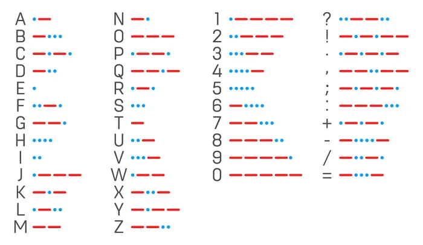

# Morse-Code-Translator

Basic implentation of a Morse Code translator

[^1]


A to 0 is implemented!

## Get-Started

> WARNING: when translating make sure there is spaces between each morse code symbol! e.g: `.- -...` == A B or a b.

- Dot: `.`
- Dash:`-`

In a Terminal:

```Powershell
python -m venv .venv
.\.venv\Scripts\activate
pip install -r .\requirements.txt
py .\main.py
```

### TODO

- [x] Add support for small characters
- [x] Change the default font so that is shows `.` and `-` render better

[^1]: [Image Cred](https://scoutlife.org/hobbies-projects/funstuff/575/morse-code-translator/)
